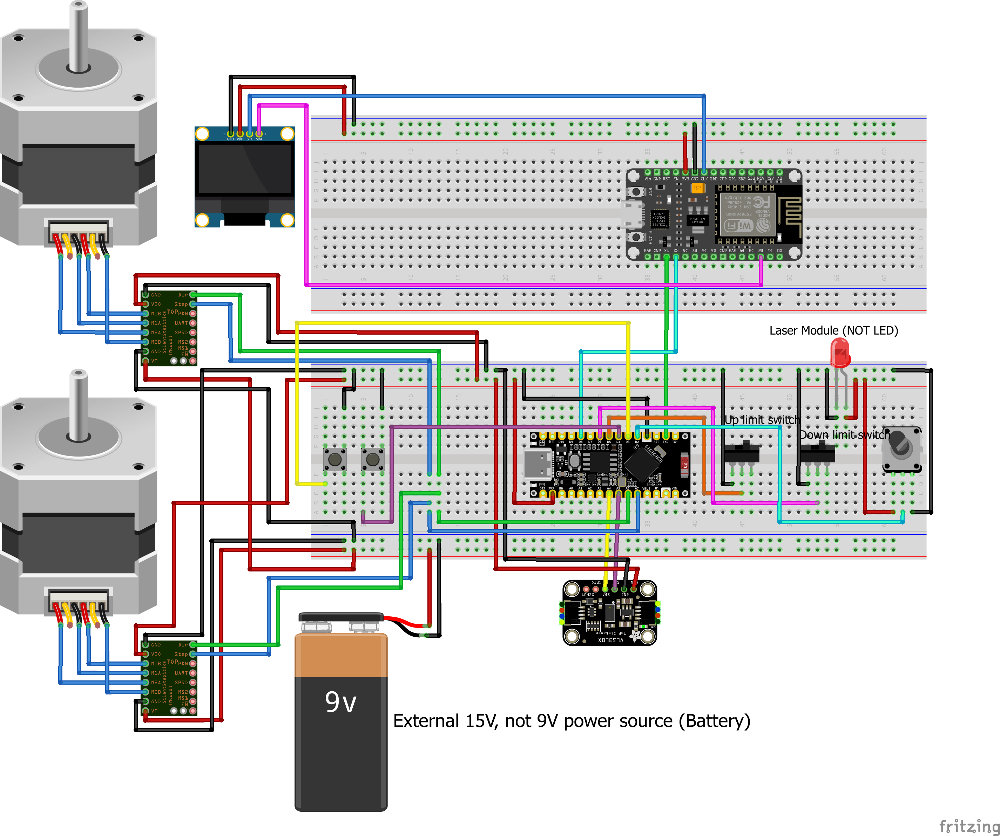

# Kom i gang med projektet

## Forudsætninger

- Python 3.3 eller nyere (tjek med `python --version` eller `python3 --version`)

---

## Opsætning af webserver

### 1. Klon projektet

```bash
git clone https://github.com/JustBobber/IoT_34315
cd IoT_34315
```

### 2. Opret virtuelt miljø

```bash
python3 -m venv .venv
```

### 3. Aktivér miljøet

**macOS / Linux:**
```bash
source .venv/bin/activate
```

**Windows:**
```bash
.venv\Scripts\activate
```

Du kan se at miljøet er aktivt når terminalen viser `(.venv)` foran din prompt.

### 4. Installér afhængigheder

```bash
pip install -r requirements.txt
```

## Opsætning af ESP'er
De to ESP'er skal have installeret firmware. Filerne ligger i ./firmware/esp/ESP8266_disp og ./firmware/esp/ESP32S3-Nano_controller til ESP8266 og ESP32S3 hhv.

### Installer firmware til ESP8266
Inden installation af firmwaren, kan det være nødvendigt at disconnecte RX-TX linket mellem ESP32 og ESP8266.
Åben filen ./firmware/esp/ESP8266_disp/ESP8266_disp.ino i Arduino IDE og installer den på ESP8266'eren.

Husk at forbind TX-RX linket igen hvis det er disconnected.

### Installer firmware til ESP32S3-Nano

Åben filen ./firmware/esp/ESP8266_disp/ESP32S3-Nano_controller.ino i Arduino IDE 
Opdater linje 45-48 til wifi netværk, password og serverens ip addresse:
```
/*
* Sørg for at starte serveren for at modtage og se dataene på localhost:5050.
*/
const char* WIFI_SSID = "<wifi name>";				    // update ssid
const char* WIFI_PASSWORD = "<wifi password>";			// update pw
const char* SERVER_BASE_URL = "http://<...ip...:5050";	// update ip
```
Når netværks instillernge er sat, installer koden på ESP32'eren.

---

# Daglig brug
For at køre projektet er der to ting du skal have kørende: webappen og ESP'erne.
Webappen står for backed og frontend. Der modtager data fra ESP, logger det i database og laver en hjemmeside hvor dataen kan ses.

ESP'erne står indsamler og sender data til webappen når en træning session er i gang. Ellers poller den serveren for at 
tjekke om der er en user logget ind da dette er et krav for at kunne påbegynde en træningssession. 

## Start server, webapp og populer database

### Aktiver virtual environment
Hver gang du åbner en ny terminal skal du aktivere miljøet igen:

```bash
source .venv/bin/activate   # macOS / Linux
.venv\Scripts\activate      # Windows
```

### Start webappen
```bash
python3 src/app.py
```
besøg siden: localhost:5050


Deaktivér venv når du er færdig:

```bash
deactivate
```

---

### Populer databasen: 
For at få noget data i databasen kør følgende script:

```bash
python3 src/seeds/alice_and_bob_seed.py
```
Det tilføjer et par users og generere et par sessions og noget data. 
Det kan køres flere gange hvis der ønskes mere data. 

### Slet databasen:
Det kan være nødvendigt/rart at slette database (training.db) den ligger her: src/training.db
```bash
rm src/training.db
```
Kør derefter seed scriptet igen for at få data i databasen.

---

## Start ESP's
Forbind det to ESP'er til power. 
OLED displayet skulle gerne vise teksten: 'GenStraek' 
og ToF sensoren skulle meget gerne gå i gang med at kalibrere ved at køre håndtaget op og derefter ned.
Hvis det er tilfældet, så bør det hele være sat op korrekt og klar til at blive brugt.

# Circuit diagram

